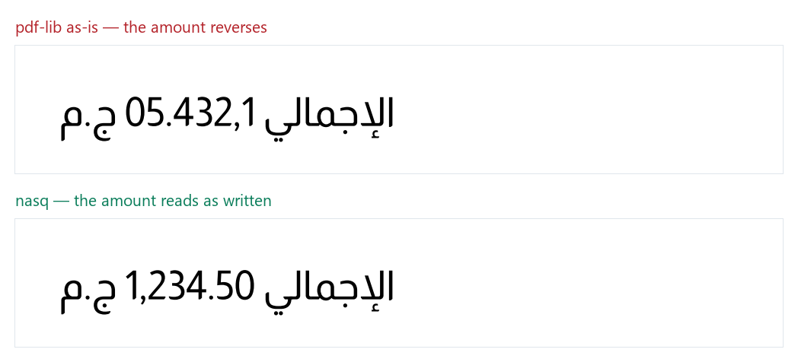

# RTL invoices print amounts backwards — measured

> **Written:** `الإجمالي 1,234.50 ج.م`
> **Printed into the PDF:** `م.ج 05.432,1 ﻲﻟﺎﻣﺟﻹا`
>
> Your customer reads **`05.432,1`**.



Two rasterised PDFs. Same text, same font, same page size — only the drawing
call differs. Generated by [`evidence.py`](evidence.py) from the files
themselves, because a browser is a conforming bidi renderer: paste the broken
string as *text* and the browser silently reorders it into something correct,
and the demonstration evaporates.

**[Arabic write-up and full results →](https://mutawafiq.opus-studio.pro/pdf/)**

---

## It is not a shaping bug, and it is not an Arabic bug

Two things people assume, both measured false:

**"JavaScript can't join Arabic letters."** It can. `pdf-lib` delegates to
`fontkit`, which runs a complete OpenType shaper. The letters come out
correctly joined. What breaks is **ordering**: the library reverses the whole
line because it sees RTL script, and the number reverses with it. That is the
job of the Unicode Bidirectional Algorithm (UAX #9), which no JavaScript PDF
library applies.

**"It only affects Arabic."** It affects every RTL script. Measured:

| Script | Amount survives? |
| --- | --- |
| Arabic | ✗ reverses |
| Hebrew | ✗ reverses |
| Persian | ✗ reverses |
| Urdu | ✗ reverses |
| Syriac | ✗ reverses |

The algorithm does not know languages — it knows character classes. So Hebrew
and Persian invoices break in exactly the same place.

## Adding a bidi library alone makes it worse

The reversal then happens **twice** — once by you, once by the drawing library
— and the letters get shaped against reversed neighbours, producing ligatures
that were never in the source. Verified against two published packages,
including one's official `pdf-lib` adapter.

The correct pipeline: resolve UAX #9 levels → split into single-direction runs
→ mirror brackets (rule L4) → draw each run in **logical** order at its own x.

## Results

Every case builds a **real PDF file**, then reads the glyph IDs back out of it
and matches them *forward*: the expected phrase is shaped with the same font and
its glyph sequence is searched for in the file. No reverse glyph→character map —
that cannot be correct, since many code points reach one glyph.

| Engine | Score |
| --- | --- |
| `pdf-lib` as-is | **0/12** |
| `naqqash` + its pdf-lib adapter | **0/12** |
| `bidi-shaper` → `pdf-lib` | **2/12** |
| **`nasq`** (ours) | **12/12** |

**In fairness:** `naqqash` states on its front page that it does *not* implement
the bidirectional algorithm and points to `bidi-js`. The score is not an
accusation that it fails its own promise — it is a measurement of what that
stated limit costs on a page with money on it. Same for `bidi-shaper`: it emits
a correct visual string, and the drawing library reverses it afterwards. **The
benchmark measures the composition, not the package alone.**

Each case carries a **named rule** from UAX #9, so disputing a case means
disputing the rule, publicly — not our opinion.

## Reproduce it

```bash
git clone https://github.com/opusstudiohq-max/arabic-invoice-mcp
cd arabic-invoice-mcp/pdf-benchmark
npm install
node run.mjs           # writes results.json
node build.mjs         # regenerates the page from it
python evidence.py     # regenerates the image from real PDFs
```

The font is chosen **per case** — the first available font covering all its
characters — and recorded with the result. Running a Hebrew case through a font
without Hebrew draws empty boxes and measures only the digits, then reports
success. That is misleading, so the runner refuses to do it.

## Two documented behaviours that are *not* failures

**Hyphenated dates reorder.** `بتاريخ 2026-09-01` displays as `01-09-2026`.
This is correct Unicode: digits after an Arabic letter become AN (rule W2), and
`-` is ES which does not join AN (W4), so it stays neutral and splits the
number. Every conforming renderer does this, including your browser. Use `/`
(a CS separator, which does join) or wrap the date in isolates.

**Bracket mirroring is not scored** — this harness cannot measure it. Mirroring
swaps the two bracket glyphs, so the multiset drawn is unchanged and glyph
presence cannot detect it. A case that passed merely because *a* bracket
appeared was awarding a meaningless point to everyone, so it was moved out of
scoring. What cannot be measured is not scored.

---

MIT · part of [Arabic invoicing tools](https://github.com/opusstudiohq-max/arabic-invoice-mcp)
· `opus.studio.hq@gmail.com`
